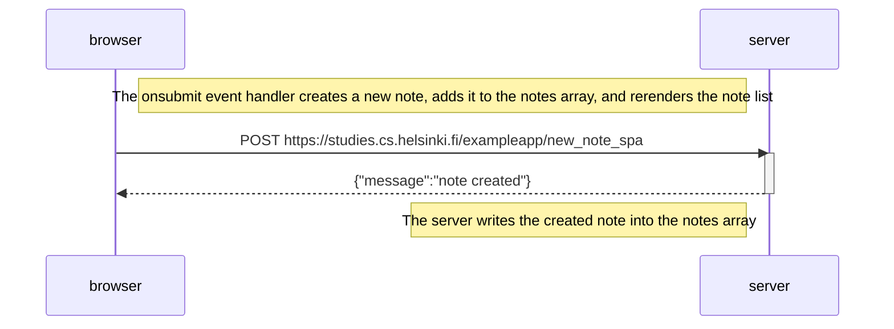

```mermaid
sequenceDiagram
    participant browser
    participant server

    Note right of browser: The onsubmit event handler creates a new note, adds it to the notes array, and rerenders the note list

    browser->>server: POST https://studies.cs.helsinki.fi/exampleapp/new_note_spa
    activate server
    server-->>browser: {"message":"note created"}
    deactivate server

    Note left of server: The server writes the created note into the notes array
```